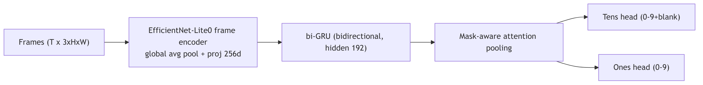
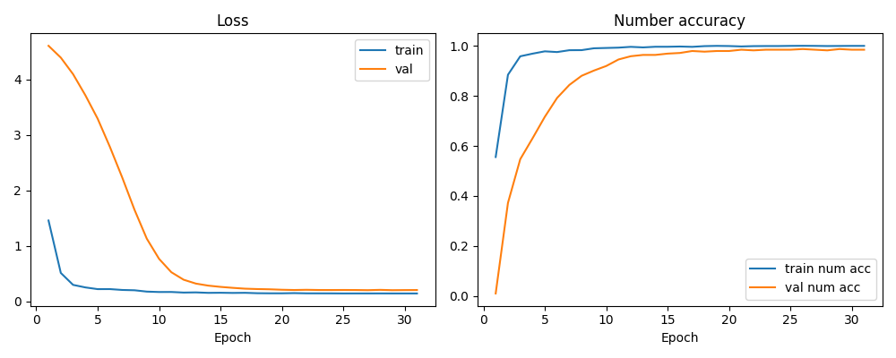

## ACME Temporal Jersey Number Recognition (EfficientNet-Lite0)
**Author: Nahian Ibn Asad**

### Model Architecture & Strategy
- Backbone: EfficientNet-Lite0 (ImageNet pretrained), early layers frozen up to block 4 for stability on small data.
- Temporal head: bi-GRU (hidden 192, 1 layer) + mask-aware attention pooling.
- Outputs: tens head (11-way: 0-9 + blank) and ones head (10-way).
- Generalization: two independent digit heads allow unseen combos (e.g., training on 4/9/49 still emits 94, 99, 44).
- Diagram:



### Data Loading
- Structure: `temporal_jersey_nr_recognition_dataset_subset/<label>/<sequence>/*.jpg`, optional `anchor.jpg`.
- Splits: stratified 80/10/10 cached at `artifacts/splits.json`.
- Training: uniform sampling to 16 frames; anchor included only for training; frame-drop p=0.02.
- Preprocess: resize 160x96 with aspect padding (`--keep-aspect`), bicubic+antialias, sharpness 1.1, normalize with ImageNet stats.

### Training & Optimization
- Hyperparams: embed_dim 256, hidden_dim 192, num_layers 1, dropout 0.1; epochs 31 with patience 10.
- Optimizer: AdamW (lr 6e-4, weight decay 1e-4); scheduler: linear warmup 2 epochs → cosine decay; grad clip 5.0; label smoothing 0.01.
- Regularization: frame-drop 0.02, anchor-only for training, dropout 0.1; no class weights for this run.
- Mixed precision: enabled (`--amp`); EMA decay 0.999; pin-memory loaders, 4 workers.
- Lightweight choices: EfficientNet-Lite0 backbone with early-layer freezing, shallow 1-layer bi-GRU + attention instead of a heavy transformer, low-res inputs (160x96) and capped sequence length (16 frames), mixed precision for speed/latency trade-off.
- Training command used:
```bash
python3 -m src.train \
  --encoder efficientnet_lite0 --freeze-until-layer 4 \
  --epochs 31 --patience 10 --batch-size 32 \
  --max-frames 16 --image-height 160 --image-width 96 \
  --lr 6e-4 --label-smoothing 0.01 --frame-drop-prob 0.02 --sharpness 1.1 \
  --num-workers 4 --pin-memory --amp --no-class-weights --keep-aspect \
  --ema-decay 0.999 --save-dir artifacts/full_run
```

### Results & Analysis (EfficientNet-Lite0, keep-aspect, max_frames=16)
- Test (temporal): loss 0.2881, tens_acc 1.000, ones_acc 0.9661, number_acc 0.9661.
- Test (single-frame, max_frames=1): loss 0.5710, tens_acc 0.9740, ones_acc 0.9036, number_acc 0.8880.
- Temporal benefit: +7.81% absolute number accuracy vs anchor-only.
- Curves: see `artifacts/full_run/runs/curves.png` (train/val loss and number accuracy).
- History: `artifacts/full_run/runs/history.json` contains per-epoch train/val loss and tens/ones/number accuracy.


### Conclusion & Next Steps
- Temporal stability: attention over bi-GRU markedly outperforms single-frame; sequence context resolves blur/occlusion.
- Next steps (00-99 scaling & latency):
  1) Quantize/INT8 or TorchScript for edge deployment.
  2) Try slightly stronger backbones (e.g., MobileNetV3-Large/Lite1) then distill back to Lite0.
  3) Add temporal jitter (±1 frame shuffle) and stronger aug if overfitting persists.
  4) Add confidence-based smoothing across clips sharing a track ID at inference.

### Trained Weights Summary
- Checkpoint: `artifacts/full_run/best_model.pt`
- Config: image 160x96, max_frames 16, embed_dim 256, hidden_dim 192, layers 1, dropout 0.1, encoder efficientnet_lite0 (pretrained), freeze_until 4, label_smoothing 0.01, frame_drop_prob 0.02, sharpness 1.1, keep_aspect True, use_anchor True.

### Installation & Environment
- Python: 3.8.20 (conda). Create and activate: `conda create -n acme python=3.8.20 -y && conda activate acme`
- GPU setup: `python3 -m pip install -r requirements_gpu.txt`
- CPU setup: `python3 -m pip install -r requirements_cpu.txt --extra-index-url https://download.pytorch.org/whl/cpu`
- Requirements contents:
  - `requirements_gpu.txt`: torch==2.0.1, torchvision==0.15.2, torchaudio==2.0.2, tqdm>=4.66.1, matplotlib>=3.1.0, Pillow>=7.0.0
  - `requirements_cpu.txt`: torch==2.1.2+cpu, torchvision==0.16.2+cpu, torchaudio==2.1.2+cpu, tqdm>=4.66.1, matplotlib>=3.1.0, Pillow>=7.0.0

### Code Appendix (src)

**`src/__init__.py`**
```python
# Package marker for ACME jersey recognition solution.
```

**`src/utils.py`**
```python
import json
import random
from dataclasses import dataclass
from pathlib import Path
from typing import Dict, List, Optional, Sequence, Tuple

import torch


TENS_BLANK = 10  # extra class to encode single-digit numbers


def set_seed(seed: int) -> None:
    random.seed(seed)
    torch.manual_seed(seed)
    torch.cuda.manual_seed_all(seed)


@dataclass
class SequenceRecord:
    frames: List[Path]
    label: str
    anchor: Optional[Path] = None


def label_to_digits(label: str) -> Tuple[int, int]:
    """Map jersey label string to digit tuple (tens, ones)."""
    label = label.strip()
    if len(label) == 1:
        return TENS_BLANK, int(label)
    if len(label) == 2:
        return int(label[0]), int(label[1])
    raise ValueError(f"Unexpected jersey label: {label}")


def digits_to_label(tens: int, ones: int) -> str:
    if tens == TENS_BLANK:
        return str(ones)
    return f"{tens}{ones}"


def save_split(path: Path, split: Dict[str, List[int]]) -> None:
    path.parent.mkdir(parents=True, exist_ok=True)
    with path.open("w") as f:
        json.dump(split, f, indent=2)


def load_split(path: Path) -> Optional[Dict[str, List[int]]]:
    if path.exists():
        with path.open() as f:
            return json.load(f)
    return None


def stratified_split(
    records: Sequence[SequenceRecord],
    val_ratio: float,
    test_ratio: float,
    seed: int,
) -> Dict[str, List[int]]:
    """Return indices for train/val/test splits with per-class stratification."""
    rng = random.Random(seed)
    by_class: Dict[str, List[int]] = {}
    for idx, rec in enumerate(records):
        by_class.setdefault(rec.label, []).append(idx)

    split: Dict[str, List[int]] = {"train": [], "val": [], "test": []}
    for label, idxs in by_class.items():
        rng.shuffle(idxs)
        n = len(idxs)
        n_val = int(n * val_ratio)
        n_test = int(n * test_ratio)
        val_idxs = idxs[:n_val]
        test_idxs = idxs[n_val : n_val + n_test]
        train_idxs = idxs[n_val + n_test :]
        split["train"].extend(train_idxs)
        split["val"].extend(val_idxs)
        split["test"].extend(test_idxs)
    return split


def compute_digit_weights(records: Sequence[SequenceRecord], indices: Sequence[int]) -> Tuple[torch.Tensor, torch.Tensor]:
    tens_counts = torch.zeros(11, dtype=torch.float32)
    ones_counts = torch.zeros(10, dtype=torch.float32)
    for idx in indices:
        tens, ones = label_to_digits(records[idx].label)
        tens_counts[tens] += 1
        ones_counts[ones] += 1
    eps = 1e-6
    tens_median = tens_counts[tens_counts > 0].median() if (tens_counts > 0).any() else torch.tensor(1.0)
    ones_median = ones_counts[ones_counts > 0].median() if (ones_counts > 0).any() else torch.tensor(1.0)
    tens_w = tens_median / (tens_counts + eps)
    ones_w = ones_median / (ones_counts + eps)
    return tens_w, ones_w


def clamp_weights(t: torch.Tensor, max_value: float) -> torch.Tensor:
    return torch.clamp(t, max=max_value)
```

**`src/dataset.py`**
```python
import random
from pathlib import Path
from typing import Callable, Dict, List, Optional, Sequence, Tuple

import numpy as np
import torch
from PIL import Image, ImageOps
from torch.utils.data import Dataset
from torchvision import transforms
from torchvision.transforms import InterpolationMode

from .utils import (
    SequenceRecord,
    TENS_BLANK,
    digits_to_label,
    label_to_digits,
    load_split,
    save_split,
    stratified_split,
)


def _discover_sequences(root: Path, min_frames: int = 3) -> List[SequenceRecord]:
    records: List[SequenceRecord] = []
    for label_dir in sorted(root.iterdir()):
        if not label_dir.is_dir():
            continue
        label = label_dir.name
        for seq_dir in sorted(label_dir.iterdir()):
            if not seq_dir.is_dir():
                continue
            frames = sorted(
                [p for p in seq_dir.rglob("*.jpg") if p.name.lower() != "anchor.jpg"]
            )
            anchor = seq_dir / "anchor.jpg"
            anchor = anchor if anchor.exists() else None
            if len(frames) >= min_frames:
                records.append(SequenceRecord(frames=frames, label=label, anchor=anchor))
    return records


def default_transform(
    image_size: Tuple[int, int],
    imagenet_stats: bool = True,
    sharpness: float = 1.0,
    keep_aspect: bool = False,
    save_scaled_dir: Optional[Path] = None,
    label: Optional[str] = None,
    idx: Optional[int] = None,
) -> Callable:
    """High-quality resize with optional aspect-ratio preservation and saving scaled images."""
    h, w = image_size
    mean = [0.485, 0.456, 0.406] if imagenet_stats else [0.5, 0.5, 0.5]
    std = [0.229, 0.224, 0.225] if imagenet_stats else [0.25, 0.25, 0.25]

    def resize_and_pad(img: Image.Image) -> Image.Image:
        if not keep_aspect:
            return img.resize((w, h), resample=Image.BICUBIC)
        orig_w, orig_h = img.size
        scale = min(w / orig_w, h / orig_h)
        new_w, new_h = int(orig_w * scale), int(orig_h * scale)
        img_resized = img.resize((new_w, new_h), resample=Image.BICUBIC)
        pad_w = w - new_w
        pad_h = h - new_h
        padding = (pad_w // 2, pad_h // 2, pad_w - pad_w // 2, pad_h - pad_h // 2)
        return ImageOps.expand(img_resized, padding, fill=(128, 128, 128))

    def save_if_needed(img: Image.Image, frame_idx: int):
        if save_scaled_dir is None:
            return
        dir_path = save_scaled_dir / (label or "unknown")
        dir_path.mkdir(parents=True, exist_ok=True)
        fname = f"{idx if idx is not None else 0}_{frame_idx}.jpg"
        img.save(dir_path / fname)

    def _transform(img: Image.Image, frame_idx: int):
        img = resize_and_pad(img)
        if sharpness != 1.0:
            img = transforms.functional.adjust_sharpness(img, sharpness)
        save_if_needed(img, frame_idx)
        img = transforms.ColorJitter(brightness=0.1, contrast=0.1, saturation=0.1)(img)
        tensor = transforms.ToTensor()(img)
        tensor = transforms.Normalize(mean=mean, std=std)(tensor)
        return tensor

    return _transform


class JerseySequenceDataset(Dataset):
    def __init__(
        self,
        root: Path,
        split: str,
        split_path: Optional[Path],
        min_frames: int = 3,
        max_frames: int = 16,
        image_size: Tuple[int, int] = (96, 64),
        limit_per_class: Optional[int] = None,
        seed: int = 42,
        transform: Optional[Callable] = None,
        is_train: bool = False,
        frame_drop_prob: float = 0.0,
        imagenet_stats: bool = True,
        sharpness: float = 1.0,
        include_anchor: bool = True,
        keep_aspect: bool = False,
        save_scaled_dir: Optional[Path] = None,
    ) -> None:
        self.root = root
        self.min_frames = min_frames
        self.max_frames = max_frames
        self.image_size = image_size
        self.keep_aspect = keep_aspect
        self.save_scaled_dir = save_scaled_dir
        self._transform_factory = transform or default_transform
        self._transform_args = {
            "image_size": image_size,
            "imagenet_stats": imagenet_stats,
            "sharpness": sharpness,
            "keep_aspect": keep_aspect,
            "save_scaled_dir": save_scaled_dir,
        }
        self.is_train = is_train
        self.frame_drop_prob = frame_drop_prob if is_train else 0.0
        self.include_anchor = include_anchor if is_train else False
        self.records = _discover_sequences(root, min_frames=min_frames)

        if not self.records:
            raise ValueError(f"No sequences found under {root}")

        loaded_split = load_split(split_path) if split_path else None
        if loaded_split is None:
            split_indices = stratified_split(
                self.records, val_ratio=0.1, test_ratio=0.1, seed=seed
            )
            if split_path:
                save_split(split_path, split_indices)
        else:
            split_indices = loaded_split

        if split not in split_indices:
            raise ValueError(f"Split '{split}' not in {list(split_indices.keys())}")

        selected_indices = split_indices[split]
        if limit_per_class is not None:
            selected_indices = self._limit_by_class(selected_indices, limit_per_class)
        self.indices = selected_indices

    def _limit_by_class(self, indices: Sequence[int], limit: int) -> List[int]:
        per_class: Dict[str, List[int]] = {}
        for idx in indices:
            label = self.records[idx].label
            per_class.setdefault(label, []).append(idx)
        trimmed: List[int] = []
        for label, idxs in per_class.items():
            trimmed.extend(idxs[:limit])
        return trimmed

    def __len__(self) -> int:
        return len(self.indices)

    def __getitem__(self, idx: int):
        rec = self.records[self.indices[idx]]
        frames = rec.frames
        # Inject anchor for training only (as best single view) without exceeding max_frames.
        if self.include_anchor and rec.anchor is not None:
            base = [rec.anchor] + frames
            if len(base) <= self.max_frames:
                sampled = base
            else:
                remaining = self.max_frames - 1
                idxs = np.linspace(0, len(frames) - 1, num=remaining, dtype=int)
                sampled = [rec.anchor] + [frames[i] for i in idxs]
        else:
            if len(frames) <= self.max_frames:
                sampled = frames
            else:
                idxs = np.linspace(0, len(frames) - 1, num=self.max_frames, dtype=int)
                sampled = [frames[i] for i in idxs]
        if self.is_train and self.frame_drop_prob > 0.0:
            kept = []
            for p in sampled:
                # keep the first frame (often anchor) to avoid dropping the clearest view
                if len(kept) == 0 or random.random() > self.frame_drop_prob:
                    kept.append(p)
            sampled = kept

        transform = self._transform_factory(
            **self._transform_args, label=rec.label, idx=self.indices[idx]
        )
        images = [
            transform(Image.open(p).convert("RGB"), frame_idx=i) for i, p in enumerate(sampled)
        ]
        seq_len = len(images)

        if seq_len < self.max_frames:
            pad = torch.zeros(
                (self.max_frames - seq_len, *images[0].shape), dtype=images[0].dtype
            )
            images = images + [pad[i] for i in range(pad.shape[0])]

        tensor = torch.stack(images, dim=0)  # (T, C, H, W)
        mask = torch.zeros(self.max_frames, dtype=torch.bool)
        mask[:seq_len] = True
        tens, ones = label_to_digits(rec.label)
        return {
            "frames": tensor,
            "mask": mask,
            "tens": torch.tensor(tens, dtype=torch.long),
            "ones": torch.tensor(ones, dtype=torch.long),
            "label": rec.label,
        }


def collate_batch(batch: List[Dict]):
    frames = torch.stack([b["frames"] for b in batch], dim=0)
    mask = torch.stack([b["mask"] for b in batch], dim=0)
    tens = torch.stack([b["tens"] for b in batch], dim=0)
    ones = torch.stack([b["ones"] for b in batch], dim=0)
    labels = [b["label"] for b in batch]
    return {"frames": frames, "mask": mask, "tens": tens, "ones": ones, "labels": labels}
```

**`src/model.py`**
```python
import math
from typing import Tuple

import torch
from torch import nn
from torch.nn.utils.rnn import pack_padded_sequence, pad_packed_sequence
from torchvision import models

from .utils import TENS_BLANK


class FrameEncoder(nn.Module):
    """Configurable lightweight encoder backed by torchvision backbones."""

    def __init__(
        self,
        embed_dim: int = 256,
        freeze_until: int = 6,
        pretrained: bool = True,
        dropout: float = 0.1,
        encoder_name: str = "mobilenet_v3_small",
    ):
        super().__init__()
        self.encoder_name = encoder_name
        self.features, in_dim = self._build_backbone(encoder_name, pretrained)
        # Freeze early layers to keep training stable and efficient
        for idx, block in enumerate(self.features):
            if idx < freeze_until:
                for p in block.parameters():
                    p.requires_grad = False
        self.pool = nn.AdaptiveAvgPool2d(1)
        self.proj = nn.Sequential(
            nn.Linear(in_dim, embed_dim),
            nn.Hardswish(),
            nn.Dropout(dropout),
        )

    def _build_backbone(self, name: str, pretrained: bool):
        name = name.lower()
        if name in {"efficientnet_lite0", "efficientnet_b0"}:
            weights = models.EfficientNet_B0_Weights.DEFAULT if pretrained else None
            backbone = models.efficientnet_b0(weights=weights)
            # Classifier head is [Dropout, Linear], so grab input dim of the Linear
            in_dim = backbone.classifier[1].in_features
            return backbone.features, in_dim
        if name == "mobilenet_v3_small":
            weights = models.MobileNet_V3_Small_Weights.DEFAULT if pretrained else None
            backbone = models.mobilenet_v3_small(weights=weights)
            return backbone.features, 576
        if name == "mobilenet_v3_large":
            weights = models.MobileNet_V3_Large_Weights.DEFAULT if pretrained else None
            backbone = models.mobilenet_v3_large(weights=weights)
            return backbone.features, 960
        # fallback to small if unknown to stay lightweight
        weights = models.MobileNet_V3_Small_Weights.DEFAULT if pretrained else None
        backbone = models.mobilenet_v3_small(weights=weights)
        return backbone.features, 576

    def forward(self, x: torch.Tensor) -> torch.Tensor:
        x = self.features(x)
        x = self.pool(x).flatten(1)
        return self.proj(x)


class TemporalDigitNet(nn.Module):
    def __init__(
        self,
        embed_dim: int = 256,
        hidden_dim: int = 192,
        num_layers: int = 1,
        dropout: float = 0.1,
        freeze_until: int = 6,
        pretrained_encoder: bool = True,
        encoder_name: str = "mobilenet_v3_small",
    ):
        super().__init__()
        self.encoder = FrameEncoder(
            embed_dim=embed_dim,
            freeze_until=freeze_until,
            pretrained=pretrained_encoder,
            dropout=dropout,
            encoder_name=encoder_name,
        )
        self.temporal = nn.GRU(
            embed_dim,
            hidden_dim,
            num_layers=num_layers,
            batch_first=True,
            bidirectional=True,
            dropout=dropout if num_layers > 1 else 0.0,
        )
        self.attn = nn.Sequential(
            nn.Linear(hidden_dim * 2, hidden_dim),
            nn.Tanh(),
            nn.Linear(hidden_dim, 1),
        )
        self.tens_head = nn.Linear(hidden_dim * 2, 11)  # 0-9 + blank
        self.ones_head = nn.Linear(hidden_dim * 2, 10)  # 0-9

    def forward(self, frames: torch.Tensor, mask: torch.Tensor):
        # frames: (B, T, C, H, W), mask: (B, T)
        b, t, c, h, w = frames.shape
        flat = frames.view(b * t, c, h, w)
        encoded = self.encoder(flat)
        encoded = encoded.view(b, t, -1)

        lengths = mask.sum(dim=1).cpu()
        packed = pack_padded_sequence(encoded, lengths, batch_first=True, enforce_sorted=False)
        packed_out, _ = self.temporal(packed)
        out, _ = pad_packed_sequence(packed_out, batch_first=True, total_length=t)

        attn_logits = self.attn(out).squeeze(-1)
        attn_logits = attn_logits.masked_fill(~mask, -math.inf)
        attn_weights = torch.softmax(attn_logits, dim=1)
        context = torch.sum(attn_weights.unsqueeze(-1) * out, dim=1)

        tens_logits = self.tens_head(context)
        ones_logits = self.ones_head(context)
        return tens_logits, ones_logits, attn_weights


def build_model(config: Tuple[int, int, int, float]) -> TemporalDigitNet:
    embed_dim, hidden_dim, num_layers, dropout = config
    return TemporalDigitNet(
        embed_dim=embed_dim,
        hidden_dim=hidden_dim,
        num_layers=num_layers,
        dropout=dropout,
    )
```

**`src/train.py`**
```python
import argparse
import json
import math
from pathlib import Path
from typing import Dict, Tuple

import torch
from torch import nn, optim
from torch.cuda.amp import GradScaler, autocast
from torch.utils.data import DataLoader

try:
    from tqdm import tqdm  # type: ignore
except ImportError:
    class _TQDMStub:
        def __init__(self, iterable, **kwargs):
            self.iterable = iterable

        def __iter__(self):
            return iter(self.iterable)

        def set_postfix(self, *args, **kwargs):
            return None

    def tqdm(iterable, **kwargs):  # type: ignore
        return _TQDMStub(iterable, **kwargs)

from .dataset import JerseySequenceDataset, collate_batch
from .model import TemporalDigitNet
from .utils import clamp_weights, compute_digit_weights, set_seed


def parse_args() -> argparse.Namespace:
    parser = argparse.ArgumentParser(description="Train temporal jersey digit recognizer.")
    parser.add_argument(
        "--data-root",
        type=Path,
        default=Path("temporal_jersey_nr_recognition_dataset_subset"),
        help="Root folder with class-labelled sequence directories.",
    )
    parser.add_argument("--epochs", type=int, default=5)
    parser.add_argument("--batch-size", type=int, default=32)
    parser.add_argument("--lr", type=float, default=6e-4)
    parser.add_argument("--weight-decay", type=float, default=1e-4)
    parser.add_argument("--max-frames", type=int, default=16)
    parser.add_argument("--min-frames", type=int, default=3)
    parser.add_argument("--image-height", type=int, default=160)
    parser.add_argument("--image-width", type=int, default=96)
    parser.add_argument("--hidden-dim", type=int, default=192)
    parser.add_argument("--embed-dim", type=int, default=256)
    parser.add_argument("--num-layers", type=int, default=1)
    parser.add_argument("--dropout", type=float, default=0.1)
    parser.add_argument("--freeze-until-layer", type=int, default=6, help="Freeze early encoder blocks for stability.")
    parser.add_argument("--no-pretrained-encoder", action="store_true", help="Disable ImageNet pretraining on the encoder.")
    parser.add_argument(
        "--encoder",
        type=str,
        default="mobilenet_v3_small",
        help="Encoder backbone: mobilenet_v3_small|mobilenet_v3_large|efficientnet_lite0 (alias: efficientnet_b0).",
    )
    parser.add_argument("--frame-drop-prob", type=float, default=0.02, help="Random frame drop probability during training.")
    parser.add_argument("--label-smoothing", type=float, default=0.02)
    parser.add_argument("--no-class-weights", action="store_true", help="Disable digit-balanced loss weighting.")
    parser.add_argument("--max-class-weight", type=float, default=3.0, help="Clamp for digit class weights to avoid instability.")
    parser.add_argument("--warmup-epochs", type=int, default=2, help="Epochs for linear LR warmup before cosine schedule.")
    parser.add_argument("--sharpness", type=float, default=1.1, help="Mild sharpness adjustment for upsampled low-res inputs (1.0 disables).")
    parser.add_argument("--no-anchor", action="store_true", help="Disable using anchor.jpg during training even if present.")
    parser.add_argument("--amp", action="store_true", help="Enable mixed precision training (recommended on CUDA).")
    parser.add_argument("--pin-memory", action="store_true", help="Enable pinned memory for faster host->GPU transfer.")
    parser.add_argument("--keep-aspect", action="store_true", help="Keep aspect ratio by padding instead of stretching.")
    parser.add_argument("--save-scaled-dir", type=Path, default=None, help="Optional dir to save scaled images for inspection.")
    parser.add_argument("--ema-decay", type=float, default=0.999, help="EMA decay for model weights (0 disables EMA).")
    parser.add_argument("--num-workers", type=int, default=0)
    parser.add_argument("--seed", type=int, default=42)
    parser.add_argument("--limit-per-class", type=int, default=None, help="Optional limit for quick iterations.")
    parser.add_argument("--save-dir", type=Path, default=Path("artifacts"))
    parser.add_argument(
        "--device",
        type=str,
        default="cuda:0",
        help="Device string. Default runs on GPU (e.g., cuda:0). Set to cpu to force CPU.",
    )
    parser.add_argument("--patience", type=int, default=10, help="Early stopping patience based on val loss.")
    parser.add_argument(
        "--split-cache",
        type=Path,
        default=Path("artifacts/splits.json"),
        help="Path to persist dataset split indices.",
    )
    return parser.parse_args()


def select_device(device_arg: str) -> torch.device:
    normalized = device_arg.lower()
    if normalized == "auto":
        if torch.cuda.is_available():
            device = torch.device("cuda:0")
            torch.backends.cudnn.benchmark = True
            return device
        if getattr(torch.backends, "mps", None) and torch.backends.mps.is_available():
            return torch.device("mps")
        return torch.device("cpu")

    if normalized.startswith("gpu"):
        suffix = device_arg.split(":", 1)[1] if ":" in device_arg else "0"
        device_str = f"cuda:{suffix}"
    elif normalized.startswith("cuda"):
        device_str = device_arg if ":" in device_arg else "cuda:0"
    elif normalized == "cpu":
        device_str = "cpu"
    else:
        device_str = device_arg

    if device_str.startswith("cuda"):
        if not torch.cuda.is_available():
            print("CUDA requested but not available, falling back to CPU.")
            return torch.device("cpu")
        torch.backends.cudnn.benchmark = True
    return torch.device(device_str)


class ModelEMA:
    def __init__(self, model: nn.Module, decay: float):
        self.decay = decay
        self.shadow = {k: v.detach().clone() for k, v in model.state_dict().items()}
        self.backup = None

    @torch.no_grad()
    def update(self, model: nn.Module):
        for k, v in model.state_dict().items():
            if not v.dtype.is_floating_point:
                self.shadow[k] = v.detach().clone()
                continue
            self.shadow[k].mul_(self.decay).add_(v.detach(), alpha=1.0 - self.decay)

    @torch.no_grad()
    def apply_to(self, model: nn.Module):
        self.backup = {k: v.detach().clone() for k, v in model.state_dict().items()}
        model.load_state_dict(self.shadow, strict=True)

    @torch.no_grad()
    def restore(self, model: nn.Module):
        if self.backup is not None:
            model.load_state_dict(self.backup, strict=True)
            self.backup = None


def to_device(batch: Dict, device: torch.device) -> Dict:
    return {
        "frames": batch["frames"].to(device),
        "mask": batch["mask"].to(device),
        "tens": batch["tens"].to(device),
        "ones": batch["ones"].to(device),
        "labels": batch["labels"],
    }


def compute_metrics(tens_logits, ones_logits, tens_target, ones_target) -> Dict[str, float]:
    tens_pred = tens_logits.argmax(dim=1)
    ones_pred = ones_logits.argmax(dim=1)
    full_correct = (tens_pred == tens_target) & (ones_pred == ones_target)
    return {
        "tens_acc": (tens_pred == tens_target).float().mean().item(),
        "ones_acc": (ones_pred == ones_target).float().mean().item(),
        "number_acc": full_correct.float().mean().item(),
    }


@torch.no_grad()
def run_eval(
    model: TemporalDigitNet,
    loader: DataLoader,
    device: torch.device,
    criterion_tens: nn.Module,
    criterion_ones: nn.Module,
    use_amp: bool,
) -> Tuple[float, Dict[str, float]]:
    model.eval()
    total_loss = 0.0
    total = 0
    metrics_sum = {"tens_acc": 0.0, "ones_acc": 0.0, "number_acc": 0.0}
    for batch in loader:
        batch = to_device(batch, device)
        with autocast(enabled=use_amp):
            tens_logits, ones_logits, _ = model(batch["frames"], batch["mask"])
            loss = criterion_tens(tens_logits, batch["tens"]) + criterion_ones(ones_logits, batch["ones"])
        bs = batch["frames"].size(0)
        total_loss += loss.item() * bs
        total += bs
        m = compute_metrics(tens_logits, ones_logits, batch["tens"], batch["ones"])
        for k in metrics_sum:
            metrics_sum[k] += m[k] * bs
    if total == 0:
        return 0.0, {k: 0.0 for k in metrics_sum}
    return total_loss / total, {k: v / total for k, v in metrics_sum.items()}


def train():
    args = parse_args()
    set_seed(args.seed)
    device = select_device(args.device)
    use_amp = args.amp and device.type == "cuda"

    image_size = (args.image_height, args.image_width)
    use_imagenet_stats = not args.no_pretrained_encoder

    train_ds = JerseySequenceDataset(
        root=args.data_root,
        split="train",
        split_path=args.split_cache,
        min_frames=args.min_frames,
        max_frames=args.max_frames,
        image_size=image_size,
        limit_per_class=args.limit_per_class,
        seed=args.seed,
        is_train=True,
        frame_drop_prob=args.frame_drop_prob,
        imagenet_stats=use_imagenet_stats,
        sharpness=args.sharpness,
        include_anchor=not args.no_anchor,
        keep_aspect=args.keep_aspect,
        save_scaled_dir=args.save_scaled_dir,
    )
    val_ds = JerseySequenceDataset(
        root=args.data_root,
        split="val",
        split_path=args.split_cache,
        min_frames=args.min_frames,
        max_frames=args.max_frames,
        image_size=image_size,
        limit_per_class=args.limit_per_class,
        seed=args.seed,
        is_train=False,
        imagenet_stats=use_imagenet_stats,
        sharpness=1.0,
        include_anchor=False,
        keep_aspect=args.keep_aspect,
        save_scaled_dir=args.save_scaled_dir,
    )

    train_loader = DataLoader(
        train_ds,
        batch_size=args.batch_size,
        shuffle=True,
        num_workers=args.num_workers,
        pin_memory=args.pin_memory,
        persistent_workers=args.num_workers > 0,
        collate_fn=collate_batch,
    )
    val_loader = DataLoader(
        val_ds,
        batch_size=args.batch_size,
        shuffle=False,
        num_workers=args.num_workers,
        pin_memory=args.pin_memory,
        persistent_workers=args.num_workers > 0,
        collate_fn=collate_batch,
    )

    model = TemporalDigitNet(
        embed_dim=args.embed_dim,
        hidden_dim=args.hidden_dim,
        num_layers=args.num_layers,
        dropout=args.dropout,
        freeze_until=args.freeze_until_layer,
        pretrained_encoder=not args.no_pretrained_encoder,
        encoder_name=args.encoder,
    ).to(device)

    tens_w, ones_w = (None, None)
    if not args.no_class_weights:
        tens_w, ones_w = compute_digit_weights(train_ds.records, train_ds.indices)
        tens_w = clamp_weights(tens_w, args.max_class_weight).to(device)
        ones_w = clamp_weights(ones_w, args.max_class_weight).to(device)

    criterion_tens = nn.CrossEntropyLoss(weight=tens_w, label_smoothing=args.label_smoothing)
    criterion_ones = nn.CrossEntropyLoss(weight=ones_w, label_smoothing=args.label_smoothing)

    optimizer = optim.AdamW(model.parameters(), lr=args.lr, weight_decay=args.weight_decay)
    scheduler = _build_scheduler(optimizer, args.epochs, args.warmup_epochs)
    scaler = GradScaler(enabled=use_amp)
    ema = ModelEMA(model, args.ema_decay) if args.ema_decay > 0 else None

    run_dir = args.save_dir / "runs"
    run_dir.mkdir(parents=True, exist_ok=True)
    history_path = run_dir / "history.json"
    best_path = args.save_dir / "best_model.pt"

    best_val_loss = float("inf")
    epochs_no_improve = 0
    history = {"train": [], "val": []}

    for epoch in range(1, args.epochs + 1):
        model.train()
        pbar = tqdm(train_loader, desc=f"Epoch {epoch}/{args.epochs}", leave=False)
        total_loss = 0.0
        total = 0
        metrics_sum = {"tens_acc": 0.0, "ones_acc": 0.0, "number_acc": 0.0}
        for batch in pbar:
            batch = to_device(batch, device)
            optimizer.zero_grad()
            with autocast(enabled=use_amp):
                tens_logits, ones_logits, _ = model(batch["frames"], batch["mask"])
                loss = criterion_tens(tens_logits, batch["tens"]) + criterion_ones(ones_logits, batch["ones"])
            scaler.scale(loss).backward()
            scaler.unscale_(optimizer)
            torch.nn.utils.clip_grad_norm_(model.parameters(), 5.0)
            scaler.step(optimizer)
            scaler.update()
            if ema is not None:
                ema.update(model)

            bs = batch["frames"].size(0)
            total_loss += loss.item() * bs
            total += bs
            m = compute_metrics(tens_logits, ones_logits, batch["tens"], batch["ones"])
            for k in metrics_sum:
                metrics_sum[k] += m[k] * bs
            pbar.set_postfix({"loss": loss.item(), "num_acc": m["number_acc"]})

        scheduler.step()

        train_loss = total_loss / total
        train_metrics = {k: v / total for k, v in metrics_sum.items()}

        # Evaluate using EMA weights if enabled
        if ema is not None:
            ema.apply_to(model)
        val_loss, val_metrics = run_eval(model, val_loader, device, criterion_tens, criterion_ones, use_amp)
        if ema is not None:
            ema.restore(model)

        history["train"].append({"loss": train_loss, **train_metrics})
        history["val"].append({"loss": val_loss, **val_metrics})

        print(
            f"Epoch {epoch}: train loss {train_loss:.4f} num_acc {train_metrics['number_acc']:.3f} | "
            f"val loss {val_loss:.4f} val num_acc {val_metrics['number_acc']:.3f}"
        )

        with history_path.open("w") as f:
            json.dump(history, f, indent=2)

        if val_loss < best_val_loss:
            best_val_loss = val_loss
            epochs_no_improve = 0
            best_path.parent.mkdir(parents=True, exist_ok=True)
            state_to_save = ema.shadow if ema is not None else model.state_dict()
            torch.save(
                {
                    "model_state": state_to_save,
                    "config": {
                        "embed_dim": args.embed_dim,
                        "hidden_dim": args.hidden_dim,
                        "num_layers": args.num_layers,
                        "dropout": args.dropout,
                        "image_size": image_size,
                        "max_frames": args.max_frames,
                        "freeze_until": args.freeze_until_layer,
                        "pretrained_encoder": not args.no_pretrained_encoder,
                        "encoder": args.encoder,
                        "label_smoothing": args.label_smoothing,
                        "frame_drop_prob": args.frame_drop_prob,
                        "sharpness": args.sharpness,
                        "use_anchor": not args.no_anchor,
                        "keep_aspect": args.keep_aspect,
                    },
                },
                best_path,
            )
        else:
            epochs_no_improve += 1
            if epochs_no_improve >= args.patience:
                print("Early stopping triggered.")
                break

    _maybe_plot_history(history, run_dir / "curves.png")
    print(f"Training finished. Best val loss: {best_val_loss:.4f}. Model saved to {best_path}")


def _maybe_plot_history(history: Dict, output_path: Path) -> None:
    try:
        import matplotlib.pyplot as plt  # type: ignore
    except Exception as exc:
        print(f"Skipping curve plot due to error: {exc}")
        return
    try:
        epochs = range(1, len(history["train"]) + 1)
        plt.figure(figsize=(10, 4))
        plt.subplot(1, 2, 1)
        plt.plot(epochs, [h["loss"] for h in history["train"]], label="train")
        plt.plot(epochs, [h["loss"] for h in history["val"]], label="val")
        plt.title("Loss")
        plt.xlabel("Epoch")
        plt.legend()

        plt.subplot(1, 2, 2)
        plt.plot(epochs, [h["number_acc"] for h in history["train"]], label="train num acc")
        plt.plot(epochs, [h["number_acc"] for h in history["val"]], label="val num acc")
        plt.title("Number accuracy")
        plt.xlabel("Epoch")
        plt.legend()

        output_path.parent.mkdir(parents=True, exist_ok=True)
        plt.tight_layout()
        plt.savefig(output_path)
    except Exception as exc:
        print(f"Skipping curve plot due to error: {exc}")


def _build_scheduler(optimizer: optim.Optimizer, epochs: int, warmup_epochs: int):
    def lr_lambda(epoch: int):
        e = epoch
        if warmup_epochs > 0 and e < warmup_epochs:
            return (e + 1) / float(warmup_epochs)
        progress = (e - warmup_epochs) / max(1, epochs - warmup_epochs)
        return 0.5 * (1.0 + math.cos(math.pi * progress))

    return optim.lr_scheduler.LambdaLR(optimizer, lr_lambda=lr_lambda)


if __name__ == "__main__":
    train()
```

**`src/evaluate.py`**
```python
import argparse
import json
from pathlib import Path
from typing import Dict

import torch
from torch import nn
from torch.utils.data import DataLoader

from .dataset import JerseySequenceDataset, collate_batch
from .model import TemporalDigitNet
from .utils import set_seed
from .train import compute_metrics, select_device, to_device


def parse_args() -> argparse.Namespace:
    parser = argparse.ArgumentParser(description="Evaluate a trained jersey digit model.")
    parser.add_argument("--checkpoint", type=Path, default=Path("artifacts/best_model.pt"))
    parser.add_argument(
        "--data-root",
        type=Path,
        default=Path("temporal_jersey_nr_recognition_dataset_subset"),
        help="Root dataset directory.",
    )
    parser.add_argument("--split", type=str, default="test", choices=["train", "val", "test"])
    parser.add_argument("--batch-size", type=int, default=64)
    parser.add_argument("--num-workers", type=int, default=0)
    parser.add_argument("--limit-per-class", type=int, default=None)
    parser.add_argument("--split-cache", type=Path, default=Path("artifacts/splits.json"))
    parser.add_argument("--seed", type=int, default=42)
    parser.add_argument(
        "--max-frames-override",
        type=int,
        default=None,
        help="Optional override for max frames to evaluate (e.g., 1 for anchor-only).",
    )
    parser.add_argument(
        "--device",
        type=str,
        default="cuda:0",
        help="Device string. Default runs on GPU (e.g., cuda:0). Set to cpu to force CPU.",
    )
    parser.add_argument("--keep-aspect", action="store_true", help="Keep aspect ratio by padding instead of stretching.")
    parser.add_argument("--save-scaled-dir", type=Path, default=None, help="Optional dir to save scaled images for inspection.")
    return parser.parse_args()


@torch.no_grad()
def evaluate():
    args = parse_args()
    set_seed(args.seed)
    device = select_device(args.device)

    ckpt = torch.load(args.checkpoint, map_location=device)
    cfg = ckpt["config"]
    model = TemporalDigitNet(
        embed_dim=cfg["embed_dim"],
        hidden_dim=cfg["hidden_dim"],
        num_layers=cfg["num_layers"],
        dropout=cfg["dropout"],
        freeze_until=cfg.get("freeze_until", 6),
        pretrained_encoder=cfg.get("pretrained_encoder", True),
        encoder_name=cfg.get("encoder", "mobilenet_v3_small"),
    ).to(device)
    model.load_state_dict(ckpt["model_state"])
    model.eval()

    ds = JerseySequenceDataset(
        root=args.data_root,
        split=args.split,
        split_path=args.split_cache,
        min_frames=3,
        max_frames=args.max_frames_override or cfg["max_frames"],
        image_size=tuple(cfg["image_size"]),
        limit_per_class=args.limit_per_class,
        seed=args.seed,
        is_train=False,
        imagenet_stats=cfg.get("pretrained_encoder", True),
        sharpness=cfg.get("sharpness", 1.0),
        include_anchor=False,
        keep_aspect=args.keep_aspect or cfg.get("keep_aspect", False),
        save_scaled_dir=args.save_scaled_dir,
    )
    loader = DataLoader(
        ds,
        batch_size=args.batch_size,
        shuffle=False,
        num_workers=args.num_workers,
        collate_fn=collate_batch,
        pin_memory=True,
    )

    criterion_tens = nn.CrossEntropyLoss(label_smoothing=cfg.get("label_smoothing", 0.0))
    criterion_ones = nn.CrossEntropyLoss(label_smoothing=cfg.get("label_smoothing", 0.0))
    total_loss = 0.0
    total = 0
    metrics_sum: Dict[str, float] = {"tens_acc": 0.0, "ones_acc": 0.0, "number_acc": 0.0}

    for batch in loader:
        batch = to_device(batch, device)
        tens_logits, ones_logits, _ = model(batch["frames"], batch["mask"])
        loss = criterion_tens(tens_logits, batch["tens"]) + criterion_ones(ones_logits, batch["ones"])
        bs = batch["frames"].size(0)
        total_loss += loss.item() * bs
        total += bs
        m = compute_metrics(tens_logits, ones_logits, batch["tens"], batch["ones"])
        for k in metrics_sum:
            metrics_sum[k] += m[k] * bs

    metrics = {k: v / total for k, v in metrics_sum.items()}
    report = {"split": args.split, "loss": total_loss / total, **metrics}
    print(json.dumps(report, indent=2))
    return report


if __name__ == "__main__":
    evaluate()
```

### AI usage
- Code/report authored with assistance from ChatGPT (OpenAI), approximately 54% AI assistance (within the allowed 60%).
